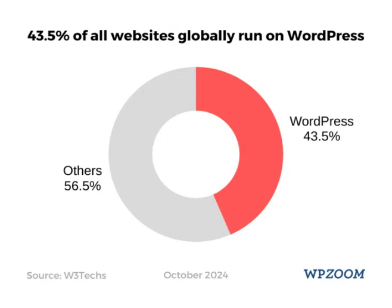
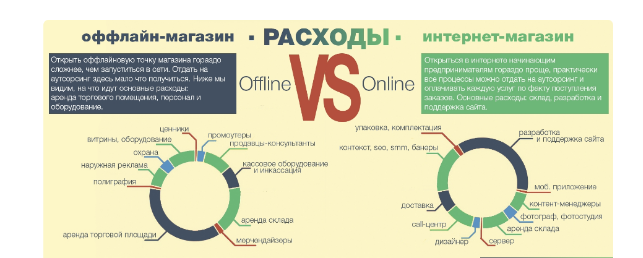
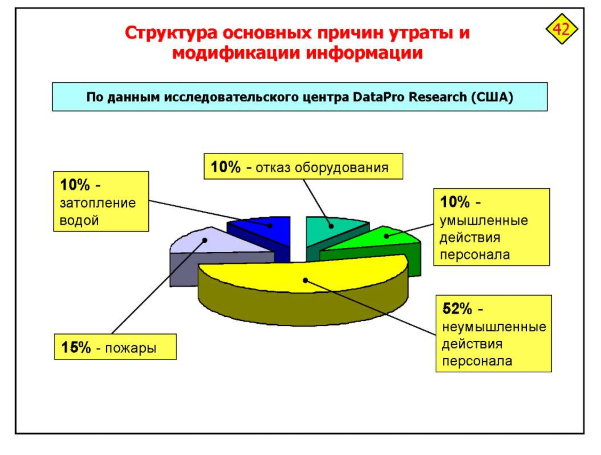

**Уровень сложности сервиса**

Созданный сервис можно назвать идеальным для людей, которые хотят попробовать себя в сфере обеспечения безопасности различных сервисов и информации в целом.

Мы использовали некоторые направления, по типу стеганографии, уязвимостей веб-приложений и базовые задания из них, которые могут дать человеку представление об ошибках настройки и халатности сотрудников, которые могут привести к не очень хорошим последствиям.

**Техническое качество**

Говоря про актуальность уязвимости, можно было бы привести статистику: По состоянию на август 2024 года более 478 миллионов сайтов используют WordPress. 

Отчет NetCraft за сентябрь 2024 года показывает в общей сложности 1,1 миллиарда веб-сайтов.

Углубляясь в WordPress, хотелось бы отметить, что тема панелей управления является достаточно популярной. Эти сайты частенько могут администрироваться не очень-то и опытными людьми, что, следовательно, приводит к очередным уязвимостям и утечкам ПДн.

Рассматривая наш стенд в контексте тренда хакерских атак, можно сказать, что никаких сложных и значимых уязвимостей в нем особо и нет. Используются стандартные методы сканирования, брутфорса в том числе, но интересной кажется особенность использования злоумышленниками, казалось бы, непредназначенных для своих целей инструментов. В нашем случае, таким оказался nginx, который с помощью возможностей настройки позволил повысить права на сервере.

Мы старались рассмотреть наиболее типовой вариант подобного магазина, но и добавить интересные моменты по типу шифрования и стеганографии, для того чтобы заинтересовать участника сесть и подробнее изучить темы, в которых только что копался.

Удобство интеграции

Для сервиса присутствует вся документация по:

- Установке
- Настройке
- Эксплуатации уязвимостей. 

Если рассматривать сервис в плане интеграции для обучения - то опять же, сервис позволяет участникам в легком формате попробовать себя, возможно подойдет как одно из начальных заданий компетенции по безопасности.

Машине с работающим сервисом для полноценной работы с парой пользователей хватает 340МБ ОЗУ и пары ядер. 

В проекте используется только open-source, доступный в репозиториях Debian и на сайте Wordpress, что позволяет не задумываться о проблемах лицензирования.

Если рассматривать используемую нами систему в плане легкости администрирования и эксплуатации стенда, с помощью bash-скриптов были автоматизированы установка/настройка/очистка стенда, что позволяет быстро разворачивать стенд на любой платформе виртуализации.

**Актуальность сервиса**

Наш сервис представляет собой интернет-магазин сетевого оборудования. Учитывая особенности современного мира и, в частности, требования организаций, можно сказать, что наш сервис крайне актуален. Абсолютно каждой организации, будь то небольшой офис или крупная международная корпорация, необходимо иметь собственную сеть для обеспечения эффективной работы, обмена данными и связи между сотрудниками. В нашем магазине представлен широкий ассортимент оборудования, включая маршрутизаторы, коммутаторы, точки доступа и другое, чтобы удовлетворить потребности различных клиентов.

**Легенда**

В нашей легенде описан типовой случай невнимательности и некомпетентности сотрудников предприятий, что приводит к образованию уязвимостей в системе безопасности. Основное внимание уделяется рутинным операциями и ошибкам, которые зачастую игнорируются, тем самым создавая серьезные угрозы для информационной безопасности. 

**Креативность и уникальность**

В легенде используется достаточно оригинальный подход к обучению вопросам безопасности. Используя сценарные элементы, предлагается практическая методика, которая делает процесс изучения не только информативным, но и интересным. Такой подход способствует повышению интереса и вовлеченности аудитории.

**Глубина, проработанность и интерактивность**

Для большего погружения аудитории и лучшего понимания причины возникновения уязвимости был воссоздан сценарий общения между сотрудниками магазина, в ходе которого проясняются их задачи и, соответственно, появляются потенциальные пути использования уязвимостей.

В легенде приведены ключевые детали, которые выступают в качестве подсказок и способствуют успешному поиску и эксплуатации уязвимостей. Каждая подсказка представлена в логической последовательности, позволяя участникам понять, как шаги одного сотрудника могут открыть дверь для злоумышленников.

**Четкость и понятность**

Вся информация изложена просто и ясно, чтобы обеспечить максимальное понимание материала. Язык, который мы используем, доступен для различных уровней подготовки аудитории, что делает легенду полезной как для новичков, так и для тех, кто уже знаком с темой.

**Эффективность обхода защитных мер**

Атаки, описанные в легенде, способны обойти существующие средства защиты. Например, неопытный сотрудник может ввести неверные данные или неосторожно предоставить доступ к системным ресурсам, что делает традиционные меры безопасности неэффективными. Этот аспект подчеркивает актуальность повышения уровня защиты и адаптации к новым сценариям угроз.

**Комбинация ранее несвязанных техник**

Уникальность нашей легенды также заключается в том, что она использует комбинацию различных техник атаки, которые ранее не были связаны друг с другом. Например, ошибки в конфигурации оборудования могут быть эффективно использованы совместно со стеганографией, алгоритмами шифрования, что создает сложные сценарии для пользователей и повышает риски для организации.

